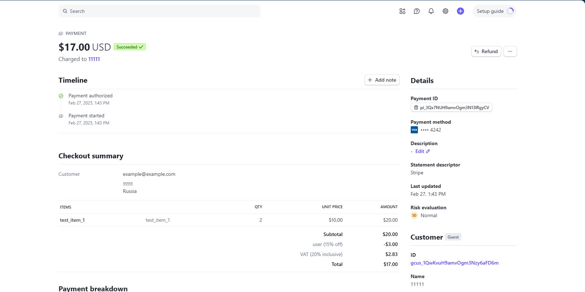

<a id="readme-top"></a>
# Django-Stripe Test app

Простое приложение Django с одной html страничкой, который общается со Stripe и создает платёжные формы для товаров.


## Инструменты:
### Основной стек:
- Django
- SQLite3
- Stripe

### Дополнительные инструменты:
- python-dotenv (Для работы с переменными окружения в Django)
- Docker
- black (Автоматически форматирует код в соответствии с PEP 8)
- isort ( Автоматически сортирует импорты в соответствии с PEP 8)

Смотри полный список зависимостей в [requirements.txt](./requirements.txt).

### ИИ-ассистенты
- DeepSeek
- GigaChat


---

## Roadmap
Основные задачи: 

- [x] Создать item app
- [x] Django Модель Item с полями (name, description, price) 
- [x] API с двумя методами:
  - [x] GET /buy/{id}, c помощью которого можно получить Stripe Session Id для оплаты выбранного Item. При выполнении этого метода c бэкенда с помощью python библиотеки stripe должен выполняться запрос stripe.checkout.Session.create(...) и полученный session.id выдаваться в результате запроса
  - [x] GET /item/{id}, c помощью которого можно получить простейшую HTML страницу, на которой будет информация о выбранном Item и кнопка Buy. По нажатию на кнопку Buy должен происходить запрос на /buy/{id}, получение session_id и далее  с помощью JS библиотеки Stripe происходить редирект на Checkout форму stripe.redirectToCheckout(sessionId=session_id)
- [x] Залить решение на Github, описать запуск в Readme.md
- [x] Опубликовать свое решение чтобы его можно было быстро и легко протестировать. 

Бонусные задачи: 

- [x] Запуск используя Docker
- [x] environment variables
- [x] Просмотр Django Моделей в Django Admin панели 
- [x] Запуск приложения на удаленном сервере, доступном для тестирования
- [x] Модель Order, в которой можно объединить несколько Item и сделать платёж в Stripe на содержимое Order c общей стоимостью всех Items
- [x] Модели Discount, Tax, которые можно прикрепить к модели Order и связать с соответствующими атрибутами при создании платежа в Stripe - в таком случае они корректно отображаются в Stripe Checkout форме. 
- [x] Добавить поле Item.currency, создать 2 Stripe Keypair на две разные валюты и в зависимости от валюты выбранного товара предлагать оплату в соответствующей валюте
- [x] Реализовать не Stripe Session, а Stripe Payment Intent.

Дополнительно:

- [x] Развернуть приложение с помощью docker-compose
- [ ] Настроить статику и nginx

<p align="right">(<a href="#readme-top">back to top</a>)</p>

---


## Запросы для тестирования
На локальной машине
```
http://127.0.0.1:8000 
```


На VDS
```
http://80.64.17.185:8080
```

Админка (admin:admin)
```
/admin/
```

Информация о выбранном Item и кнопка Buy
```
/item/1
```

Получить Stripe Session Id для оплаты выбранного Item
```
/buy/1
```

Информация о выбранном Order и кнопка Buy
```
/orders/2/
```

Создать налог с помощью Stripe API
```
/orders/create_tax/
```


<p align="right">(<a href="#readme-top">back to top</a>)</p>

___


#### Приложение доступно для тестирования по адресу:
http://80.64.17.185:8080/

Админка:
http://80.64.17.185:8080/admin/
username:password => admin:admin

Информация о выбранном Item и кнопка Buy
http://80.64.17.185:8080/item/2

Получить Stripe Session Id для оплаты выбранного Item
http://80.64.17.185:8080/buy/2

Информация о выбранном Order и кнопка Buy
http://80.64.17.185:8080/orders/2/


<p align="right">(<a href="#readme-top">back to top</a>)</p>

---


## Запуск приложения c помощью Docker

*  #### Клонирование репозитория
   ```bash
   git clone https://github.com/Ridmovies/django-stripe-app.git
   ```
  
*  #### Установка Docker Engine
- https://docs.docker.com/engine/install/
- https://docs.docker.com/engine/install/ubuntu/

* #### Вход в корневую папку приложения:
    ```bash
   cd stripe_test_app
    ```

*  #### Сборка нового образа и запуск контейнера
```bash
docker build -t stripe_app .
docker run -p 8000:8000 stripe_app
```

<p align="right">(<a href="#readme-top">back to top</a>)</p>

---


## Запуск проекта локально
*  #### Клонирование репозитория
   ```bash
   git clone https://github.com/Ridmovies/django-stripe-app.git
   ```
   
* #### Вход в корневую папку приложения:
    ```bash
   cd stripe_test_app
    ```
   
* #### Создайте виртуальную среду в корневой папке проекта:
```bash
  python3 -m venv .venv
```

* #### Активируйте виртуальную среду:
```bash
  source .venv/bin/activate   # venv\Scripts\activate (для Windows)
```

* #### Установите зависимости:
```bash
  pip install -r requirements.txt
```

 * #### Создать суперпользователя
```bash
  python manage.py createsuperuser
```

* #### Изменение файла .env
1. Переименуйте '.env.template' в '.env'
2. Замените настройки на свои собственные


* #### Запуск приложения
 ```bash
  python manage.py runserver 0.0.0.0:8000
```

<p align="right">(<a href="#readme-top">back to top</a>)</p>

---


## DEVELOP 
Команды используемые при разработке приложения

### Django команды:
Запуск приложения
```bash
  python manage.py runserver 0.0.0.0:8000
```

Создать новый проект Django:
```bash
  django-admin startproject stripe_test_app
```

Создать новое приложение:
```bash
  python manage.py startapp items
```

Создать Супер пользователя
```bash
    python manage.py createsuperuser
```

Создать и применить миграции:
```bash
    python manage.py makemigrations
    python manage.py migrate
```

<p align="right">(<a href="#readme-top">back to top</a>)</p>

---

### Docker

Сборка образа из Dockerfile:
```
  docker build -t [имя_образа]:[версия] .
```


Запуск нового контейнера:
```
  docker run -p 5000:8000 [имя_образа]
```

Чтобы запустить консоль внутри работающего контейнера Docker, используйте команду docker exec
```
  docker exec -it имя_контейнера bash
```

### Docker-compose

Полная очистка Docker

```
docker-compose down  # Остановка и удаление контейнеров
docker system prune -a  # Очистка Docker (осторожно, удаляет все неиспользуемые данные)
```


### Линтеры и форматеры:
```bash
black --check --diff .
```

```bash
isort --check-only --diff --profile black .
```

<p align="right">(<a href="#readme-top">back to top</a>)</p>

---


## Полезные ссылки:
Stripe. API:
https://docs.stripe.com/api?lang=python

Stripe. Simulate payments to test your integration:
https://docs.stripe.com/testing

Stripe. Accept a payment: 
https://docs.stripe.com/payments/accept-a-payment?integration=checkout


<p align="right">(<a href="#readme-top">back to top</a>)</p>

---